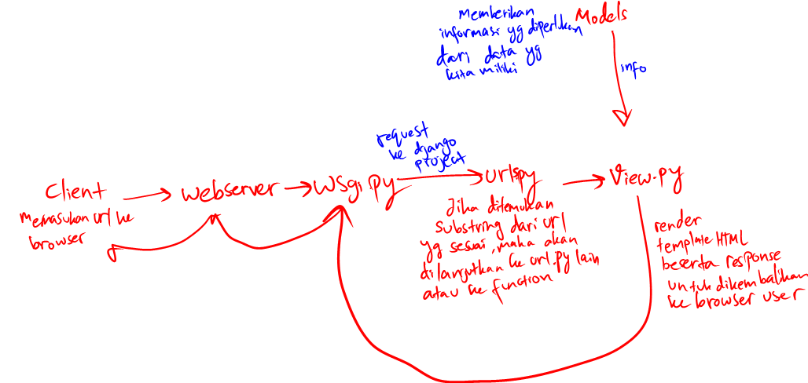

1. Pertama-tama saya membuat folder baru bernama "trading_game" kemudian menyalakan virtual environment dengan menjalankan line "python -m venv env", kemudian membuat project dengan line
   "django-admin startproject trading_game" di cmd. Setelah project sudah ada, saya lanjutkan dengan membuat app dengan "django-admin startapp main". Saya menambahkan line di file urls.py agar saat
   client membuat request ke server, client bisa menjangkau app "main". Setelah itu saya membuat program views milik app untuk men-return template dan response berisi data dari model. Setelah itu
   saya membuat class Items di models.py milik app beserta dengan attribute class-nya.
   Saya pun menambahkan file initialize_item.json untuk membuat instansiasi dari Items di-list dan menggunakan command "django-admin loaddata initialize_item" sehingga objek dari models terbentuk.
   Setelah itu saya bermain dengan html dan css untuk waktu yang terlalu lama.
2. 
3. Virtual environment digunakan dalam pengembangan aplikasi django untuk mempermudah pengerjaan kita karena kita menghilangkan masalah dari ketergantungan terhadap versi django dan requirements lain
   yang diperlukan untuk program berjalan. Dengan kita membuat virtual environment, segala requirements yang kita download hanya berpengaruh di environment tersebut misalkan jika mengerjakan berbagai
   projek django yang tiap projek dibuat dengan versi django yang berbeda. Dengan adanya virtual environment tiap django yang kita download untuk menyesuaikan versi tiap django projek hanya
   berpengaruh pada masing-masing environment tersebut dan kita tidak perlu berulang-ulang download tiap versi django jika kita mengerjakan projek-projek tersebut secara bergantian. Jadi, virtual
   environment sebenarnya tidak diperlukan untuk menjalankan suatu projek django. Namun, akan sangat membantu saat kita mengerjakan berbagai projek django dengan versi yang berbeda-beda.

4. MVC adalah pola arsitektur dari suatu aplikasi yang memisahkan aplikasi menjadi tiga komponen utama yaitu model, view dan controller.
   Model merupakan bagian yang berhubungan dengan semua logika yang berhubungan dengan data yang dimiliki.
   View merupakan bagian dari aplikasi yang berhubungan dengan tampilan aplikasi dan mengandung elemen seperti semua komponen UI untuk user berinteraksi berserta data yang didapatkan dari controller.
   Controller merupakan bagian yang berfungsi untuk memproses semua request yang masuk serta memanipulasi data dari dan pada model dan mengatur tampilan view serta data yang akan digunakan pada view
   dari model.
   MVT adalah pola arsitektur aplikasi yang memiliki bagian-bagian, yaitu model, view, template.
   Template adalah html yang akan dilihat dan digunakan oleh user. View berguna untuk menerima request dan memberikan response dalam rupa template yang dirender sebelum dikirim ke web browser user.
   Model pada kedua aplikasi ini bersifat sama.
   MVVM digunakan karena developer ingin memisahkan logika program dengan pengaturan user interface. MVVM terbagi menjadi Model, View, dan ViewModel.
   Model memuat program yang digunakan dalam aplikasi yang akan diambil oleh ViewModel ketika view menerima request.
   ViewModel adalah bagian yang menjembatani Model data menuju dan dari view.
   View merupakan bagian elemen yang terlihat oleh user yang mengandung elemen seperti UI, text, animasi, dll. View juga berguna untuk menerima input dari user dan diteruskan ke ViewModel.

   Perbedaan ketiganya adalah dari bagaimana aplikasi yang menggunakannya menjadi terstruktur. Pada aplikasi yang memanfaatkan MVC, model pada aplikasi berguna untuk menyimpan data, view untuk
   mengolah interface yang akan dilihat oleh user dan controller yang berguna untuk memanipulasi data pada dan dari model serta mengatur bagaimana view akan dilihat oleh user. Sedangkan pada MVT,
   model memiliki peran yang sama, tetapi template pada MVT yang memliki peran lebih mirip dengan view pada MVC. View pada MVT berguna untuk menerima request dan membuat template yang sesuai dengan
   reqest tersebut. Sedangkan untuk MVVM, model memiliki peran sumber data untuk aplikasi tersebut dan view adalah tampilan yang memiliki berbagai elemen, tetapi tiap fungsionalitas elemen diatur oleh
   viewmodel. Viewmodel sendiri berguna untuk mengatur semua data yang disalurkan ke view termasuk cara suatu elemen berinteraksi.
